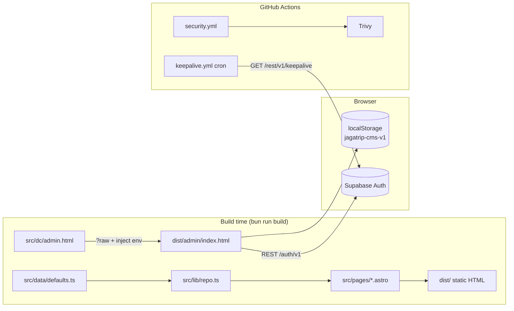
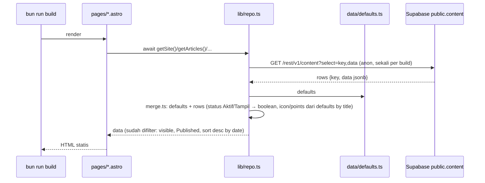
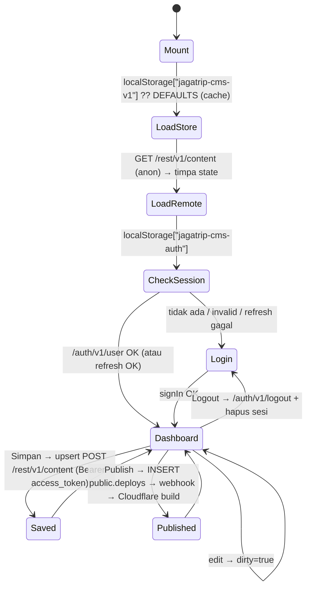

# JAGATRIP CMS

Situs publik JAGATRIP (Edu-Tourism, benchmarking, partnership) + panel admin `/admin`.
Astro 7 static output, Bun, Supabase Auth. Deploy ke Cloudflare (Workers static assets).

---

## Daftar isi

1. [Arsitektur singkat](#1-arsitektur-singkat)
2. [Struktur repo](#2-struktur-repo)
3. [Setup lokal](#3-setup-lokal)
4. [Environment variables](#4-environment-variables)
5. [Perintah](#5-perintah)
6. [Flow data halaman publik](#6-flow-data-halaman-publik)
7. [Flow admin `/admin`](#7-flow-admin-admin)
8. [Autentikasi (Supabase Auth)](#8-autentikasi-supabase-auth)
9. [Manajemen user](#9-manajemen-user)
10. [SEO](#10-seo)
11. [Keepalive Supabase](#11-keepalive-supabase)
12. [Security scan (Trivy)](#12-security-scan-trivy)
13. [Deploy (Cloudflare)](#13-deploy-cloudflare)
14. [Troubleshooting](#14-troubleshooting)
15. [Roadmap / batas desain](#15-roadmap--batas-desain)

---

## 1. Arsitektur singkat



Prinsip:

- **Static-only.** Tidak ada server runtime. Semua HTML dirender saat build.
- **Satu pintu data.** Halaman publik hanya baca dari `src/lib/repo.ts`. Ganti isi fungsi di file itu = ganti sumber data (defaults → Supabase) tanpa sentuh pages.
- **Admin masih terpisah.** `/admin` adalah SPA lama berbasis framework internal "dc" (`public/support.js`) yang menyimpan konten ke `localStorage`. Login-nya sudah Supabase Auth; datanya belum.

---

## 2. Struktur repo

```
.
├── astro.config.mjs          # trailingSlash: 'ignore'; output default static
├── package.json              # packageManager: bun@1.4.2
├── bun.lock                  # lockfile v2 (butuh Bun ≥1.3)
├── tsconfig.json
├── .env                      # RAHASIA, gitignored
├── .env.example              # template env
├── .github/workflows/
│   ├── keepalive.yml         # ping Supabase tiap 3 hari
│   └── security.yml          # Trivy: vuln + secret + misconfig
├── scripts/
│   └── keepalive.ts          # bun run keepalive
├── public/
│   ├── support.js            # runtime framework "dc" untuk admin.html
│   ├── assets/gallery/       # gambar statis
│   └── uploads/              # hasil upload manual
└── src/
    ├── data/defaults.ts      # konten default (site, programs, events, articles, ...)
    ├── lib/
    │   ├── repo.ts           # API data untuk pages (getSite, getArticles, ...)
    │   ├── types.ts          # tipe Article dll.
    │   ├── format.ts         # helper format tanggal/teks
    │   └── format.test.ts    # bun test
    ├── layouts/Base.astro    # <head>, meta SEO, header/footer
    ├── components/site/      # ArticleCard, Header, Footer, Founder, PageHero, WaForm
    ├── pages/
    │   ├── index.astro       # /
    │   ├── about.astro       # /about
    │   ├── program.astro     # /program
    │   ├── contact.astro     # /contact
    │   ├── news/index.astro  # /news
    │   ├── news/[slug].astro # /news/<slug>  (getStaticPaths dari repo)
    │   └── admin/index.astro # /admin  → wrap src/dc/admin.html
    ├── dc/admin.html         # SPA admin (template + logic dalam satu file)
    └── styles/global.css
```

Build menghasilkan 7 route: `/`, `/about`, `/program`, `/contact`, `/news`, `/news/<slug>` (per artikel Published), `/admin`.

---

## 3. Setup lokal

Prasyarat: **Bun ≥ 1.3** (lockfile v2). Repo dipin ke `bun@1.4.2` via `packageManager`.

```bash
bun install --frozen-lockfile
cp .env.example .env        # isi nilai dari Supabase Dashboard → Settings → API
bun run dev                 # http://localhost:4321
```

---

## 4. Environment variables

| Nama | Scope | Wajib | Keterangan |
|---|---|---|---|
| `PUBLIC_SUPABASE_URL` | build → browser | ya | `https://<ref>.supabase.co`. Prefix `PUBLIC_` = di-inline ke HTML admin. |
| `PUBLIC_SUPABASE_ANON_KEY` | build → browser | ya | Anon key. Aman publik, dilindungi RLS. |
| `SUPABASE_SERVICE_ROLE_KEY` | lokal saja | tidak | Bypass RLS. **Jangan** taruh di Cloudflare, jangan beri prefix `PUBLIC_`, jangan commit. Dipakai hanya untuk skrip admin (buat user). |
| `KEEPALIVE_TABLE` | lokal + GH Actions | tidak | Default `keepalive`. Tabel yang di-ping. |

Cara masuk ke kode: `src/pages/admin/index.astro` baca `import.meta.env.PUBLIC_*` saat build, lalu `replace("__SUPABASE__", JSON.stringify({url,key}))` ke dalam `admin.html`. Di browser tersedia sebagai `const SB`.

Di mana disimpan:

- Lokal: `.env` (gitignored via `.env`, `.env.*`, `!.env.example`).
- Cloudflare: **Settings → Build → Variables and secrets** (bukan Runtime — runtime terkunci untuk static assets).
- GitHub Actions: repo → Settings → Secrets → `PUBLIC_SUPABASE_URL`, `PUBLIC_SUPABASE_ANON_KEY`.

---

## 5. Perintah

| Perintah | Fungsi |
|---|---|
| `bun run dev` | dev server |
| `bun run build` | build ke `dist/` |
| `bun run preview` | serve `dist/` |
| `bun test` | jalankan `src/lib/*.test.ts` |
| `bun run keepalive` | ping Supabase sekali (baca `.env`) |
| `bun run seed` | isi tabel `content` dari `defaults.ts` untuk key yang belum ada; `--force` timpa semua (butuh `SUPABASE_SERVICE_ROLE_KEY`) |

Jangan jalankan `bunx astro check` non-interaktif — hang menunggu prompt install `@astrojs/check`.

---

## 6. Flow data halaman publik



Env kosong atau fetch gagal → pakai `defaults.ts` (build tidak pernah gagal karena Supabase).

`src/lib/repo.ts`:

| Fungsi | Return |
|---|---|
| `getSite()` | `site` — siteName, baseUrl, titleTemplate, ogImage, robotsTxt, ... |
| `getPrograms()` | daftar program |
| `getEvents()` | event dengan `visible === true` |
| `getHome()` | `{ gallery, testimonials(visible), audience, faqs }` |
| `getArticles()` | artikel `status === "Published"`, urut tanggal desc |
| `getArticle(slug)` | satu artikel atau `undefined` |

`src/pages/news/[slug].astro` pakai `getStaticPaths()` → satu HTML per artikel Published.

Aturan: **pages tidak boleh import `src/data` langsung.**

---

## 7. Flow admin `/admin`

`src/dc/admin.html` = satu file berisi template HTML (sintaks `{{ }}`, `<sc-if>`, `<sc-for>`) + `<script>` logic. Runtime-nya `public/support.js` (mirip Preact: `h()`, class Component dengan `setState`, EVENT_MAP `onInput`/`onChange`/`onClick`).

### Bagian (sidebar)

| Key | Grup | Tipe | Isi |
|---|---|---|---|
| `overview` | Ringkasan | overview | statistik |
| `hero`, `about`, `founder`, `partnership`, `footer` | Halaman Publik | single | form satu objek |
| `programs`, `audience`, `events`, `testimonials`, `gallery`, `faqs` | Halaman Publik | list | daftar item, tambah/hapus/urut |
| `articles` | Konten | articles | editor artikel + panel SEO |
| `seo` | Pengaturan | single (bucket `site`) | meta global, robots, sitemap |
| `users` | Pengaturan | users | daftar user (statis, lihat §9) |

### Siklus hidup



Upload gambar: canvas resize maks 1600px → WebP 0.82 → `POST /storage/v1/object/media/<uuid>.webp` → field diisi URL publik. Belum login → data URL lokal.

### Editor artikel

- Field konten (`ARTICLE_FIELDS`): title, slug, category, author, date, status, excerpt, cover, body.
- Field SEO (`ARTICLE_SEO_FIELDS`): metaTitle, metaDescription, focusKeyword, canonical, imageAlt, ogImage, schemaType, index, follow.
- Input teks pakai `onInput` → skor **Kelengkapan SEO** update realtime.
- Skor = cek isian form, **bukan** ranking Google. Rubrik di `articleScore()`:

  | Kriteria | Poin |
  |---|---|
  | metaTitle 30–60 karakter | 20 (10 jika ada tapi di luar rentang) |
  | metaDescription 90–160 karakter | 20 (10) |
  | slug valid `^[a-z0-9]+(-[a-z0-9]+)*$` | 15 |
  | focusKeyword muncul di title | 15 |
  | imageAlt terisi | 10 |
  | canonical terisi | 10 |
  | body > 600 karakter | 10 |

### Simpan vs Publish

- **Simpan Perubahan** → tulis ke Supabase `public.content`. Belum tampil di situs (situs statis).
- **Publish ke Situs** → INSERT `public.deploys` → Database Webhook → Cloudflare Deploy Hook → build ulang (±1–2 menit). Ditolak jika masih ada perubahan belum disimpan.

### Setup sekali (Dashboard)

1. **SQL Editor** → jalankan `supabase/migrations/20260929_content.sql` (tabel `content`, `deploys`, bucket `media`, RLS). Lalu `bun run seed`.
2. **Cloudflare** → Workers & Pages → worker → Settings → Builds → **Deploy Hooks** → Create → salin URL.
3. **Supabase** → Integrations → **Database Webhooks** → Create: table `public.deploys`, event `INSERT`, type HTTP Request, method `POST`, URL = Deploy Hook. Simpan.

Deploy Hook URL adalah rahasia (siapa pun yang punya bisa memicu build). Hanya ada di webhook Supabase, tidak di repo/browser. Limit Cloudflare 10 trigger/menit.

Field `icon`, `long`, `who`, `points` (program), `flyerAlt` (event), `icon` (audience) tidak ada di form admin — diambil dari `defaults.ts` dicocokkan **by title**. Ganti judul program di admin = detail tersebut hilang (fallback: `long = desc`, `points = []`). Tambah field ke form admin bila perlu.

---

## 8. Autentikasi (Supabase Auth)

Tanpa SDK — `fetch` langsung ke GoTrue REST. Objek `sbAuth` di `admin.html`:

| Method | Endpoint | Catatan |
|---|---|---|
| `signIn(email, pw)` | `POST /auth/v1/token?grant_type=password` | 400 → "Email atau password salah."; error lain ditampilkan apa adanya |
| `refresh(refresh_token)` | `POST /auth/v1/token?grant_type=refresh_token` | dipanggil saat mount jika `user()` gagal |
| `user(access_token)` | `GET /auth/v1/user` | validasi sesi |
| `signOut(access_token)` | `POST /auth/v1/logout` | best-effort |

Header selalu: `apikey: <anon>`, `Authorization: Bearer <access_token ?? anon>`.

Sesi disimpan utuh (JSON respons token) di `localStorage["jagatrip-cms-auth"]`. Access token JWT Supabase default kadaluarsa 1 jam; refresh otomatis hanya saat reload halaman.

Role dibaca dari `user.user_metadata.role`: `super_admin` → label "Super Admin", selain itu "Admin". **Belum ada pembatasan hak** — kedua role bisa semua. Enforcement nyata harus di RLS Supabase saat data pindah ke DB.

Wajib di Supabase Dashboard → Authentication → Providers → Email: **matikan "Allow new users to sign up"**. Tanpa ini siapa pun bisa daftar lewat `/auth/v1/signup` dan login ke `/admin`.

---

## 9. Manajemen user

User dibuat lewat Admin API (service role), bukan dari UI CMS. Contoh (jalankan lokal, `.env` terisi):

```bash
set -a; source .env; set +a
PW=$(openssl rand -base64 18 | tr -d '/+=' | cut -c1-20)
curl -s -X POST "$PUBLIC_SUPABASE_URL/auth/v1/admin/users" \
  -H "apikey: $SUPABASE_SERVICE_ROLE_KEY" \
  -H "Authorization: Bearer $SUPABASE_SERVICE_ROLE_KEY" \
  -H "Content-Type: application/json" \
  -d "{\"email\":\"nama@jagatrip.com\",\"password\":\"$PW\",\"email_confirm\":true,\"user_metadata\":{\"name\":\"Nama\",\"role\":\"admin\"}}"
echo "PASSWORD: $PW"
```

Atau via Dashboard → Authentication → Users → Add user (isi `user_metadata` `{"name":"...","role":"admin"}` di kolom metadata).

Setelah itu **sinkron manual** array `USERS` di `admin.html` (halaman Pengguna hanya daftar statis untuk tampilan).

Akun saat ini:

| Email | Role |
|---|---|
| `admin@jagatrip.com` | `super_admin` |
| `content@jagatrip.com` | `admin` |
| `ryan@mediapro.work` | `super_admin` |

Reset password: Dashboard → Authentication → Users → pilih user → Reset password. Password awal yang pernah muncul di terminal dianggap bocor — ganti.

---

## 10. SEO

Sumber nilai:

- **Global** (`site` di `defaults.ts` / section SEO di admin): `titleTemplate` (`%page% | JAGATRIP`), `homeTitle`, `homeDescription`, `canonicalHome`, `ogImage`, `locale`, `robotsTxt`, `sitemap`, `indexable`.
- **Per artikel**: `metaTitle`, `metaDescription`, `canonical`, `ogImage`, `imageAlt`, `schemaType`, `index`, `follow`.

Dirender di `src/layouts/Base.astro` sebagai `<title>`, `<meta name="description">`, `<link rel="canonical">`, `og:*`, `twitter:*`, `robots`.

Catatan jujur: mengisi SEO di CMS **tidak menjamin** tampil di halaman 1 Google. Yang dikontrol: judul/deskripsi/canonical/OG yang benar dan konsisten. Ranking = konten + backlink + waktu. Data asli ada di Google Search Console, bukan di skor CMS.

OG image = gambar yang muncul saat link dibagikan di WA/FB/LinkedIn/Twitter (`og:image`). Rekomendasi 1200×630 px, < 1 MB, URL absolut.

---

## 11. Keepalive Supabase

Free tier Supabase mem-pause project setelah ~7 hari tanpa aktivitas. Solusi: query ringan terjadwal.

- Tabel: `public.keepalive` (RLS on, policy `select` untuk `anon`).
- Skrip: `scripts/keepalive.ts` → `GET ${url}/rest/v1/${table}?select=id&limit=1` dengan anon key. Exit non-zero kalau bukan 2xx.
- Jadwal: `.github/workflows/keepalive.yml` cron `0 3 */3 * *` (tiap 3 hari 03:00 UTC) + `workflow_dispatch` untuk tes manual.
- Secrets GitHub yang dibutuhkan: `PUBLIC_SUPABASE_URL`, `PUBLIC_SUPABASE_ANON_KEY`. `KEEPALIVE_TABLE` hardcode `keepalive` di workflow.

Tes lokal: `bun run keepalive` → `ok <timestamp> keepalive → 200`.

SQL bila tabel hilang:

```sql
create table public.keepalive (id int primary key default 1, pinged_at timestamptz default now());
insert into public.keepalive default values;
alter table public.keepalive enable row level security;
create policy "anon read" on public.keepalive for select to anon using (true);
```

---

## 12. Security scan (Trivy)

`.github/workflows/security.yml` — jalan di push/PR ke `main`, tiap Senin 04:00 UTC, dan manual.

- Scanner: `vuln` (CVE di `bun.lock`), `secret` (key bocor), `misconfig`.
- Severity: HIGH, CRITICAL. `ignore-unfixed: true`. Gagal (exit 1) bila ada temuan.
- Skip: `node_modules,dist,.astro`.

Lokal (Arch): `sudo pacman -S trivy`, lalu

```bash
trivy fs --scanners vuln,secret,misconfig --severity HIGH,CRITICAL --skip-dirs node_modules,dist,.astro .
```

Secret scanner akan menandai `.env` lokal — itu benar; file tersebut memang tidak boleh masuk repo. False positive: tulis ID CVE di `.trivyignore`.

---

## 13. Deploy (Cloudflare)

Project Cloudflare Workers (static assets) terhubung ke Git.

- Build command: `bun run build` — Output dir: `dist`.
- Bun version: dari `packageManager` di `package.json`. Kalau Cloudflare tetap pakai Bun lama (error `Unknown lockfile version`), set build var `BUN_VERSION=1.4.2`.
- Build vars (Settings → Build → Variables and secrets): `PUBLIC_SUPABASE_URL`, `PUBLIC_SUPABASE_ANON_KEY`.
- Runtime vars/bindings **terkunci** untuk static assets — normal, tidak dibutuhkan.

Checklist rilis:

1. `bun test` dan `bun run build` lolos lokal.
2. Push ke `main` → Cloudflare build otomatis.
3. Cek `/admin` → login berhasil, bukan pesan "Konfigurasi Supabase kosong".
4. Cek `view-source` artikel → canonical/og:image benar.

---

## 14. Troubleshooting

| Gejala | Sebab | Fix |
|---|---|---|
| Cloudflare: `Unknown lockfile version` / `lockfile had changes, but lockfile is frozen` | Bun CI < 1.3, lockfile v2 | `packageManager` sudah dipin; tambah `BUN_VERSION=1.4.2` bila perlu |
| Login: "Konfigurasi Supabase kosong…" | env `PUBLIC_*` tidak ada saat build | isi build vars di Cloudflare, redeploy |
| Login: "Email atau password salah." padahal benar | user belum `email_confirm`, atau password typo | cek Dashboard → Users; reset password |
| Login lolos tapi nama/role salah | `user_metadata` kosong | isi `name`, `role` di metadata user |
| `bun run keepalive` → 404 `PGRST205` | tabel tidak ada / tidak ter-expose | jalankan SQL §11 |
| `bun run keepalive` → env kosong | `.env` belum ada | `cp .env.example .env` lalu isi |
| Perubahan di `/admin` tidak muncul di situs | belum klik **Publish**, atau webhook belum dibuat | klik Publish; cek Supabase → Database Webhooks → logs; cek Cloudflare → Builds |
| Admin: "Gagal memuat konten (404)" | tabel `content` belum ada | jalankan migration SQL (§7) |
| Admin: "Sesi habis. Login ulang." | access_token > 1 jam | logout → login |
| Admin: "Upload gambar gagal (404)" | bucket `media` belum ada | jalankan migration SQL |
| Build pakai konten lama | `repo.ts` fallback ke defaults karena fetch gagal | lihat log build: `[repo] Supabase gagal` |
| Variables "cannot be added to a Worker that only has static assets" | itu section Runtime | pakai section **Build** |
| `bunx astro check` hang | prompt install `@astrojs/check` | jangan jalankan non-interaktif |

---

## 15. Roadmap / batas desain

Ditandai `ponytail:` di kode = penyederhanaan sengaja + jalur upgrade.

| Sekarang | Batas | Upgrade |
|---|---|---|
| 1 tabel `content` jsonb per section | tidak bisa query per artikel/filter SQL; 1 admin simpan = timpa semua section | normalisasi ke tabel `articles`, `programs`, dll. saat butuh query/relasi atau multi-editor bersamaan |
| Detail program/audience (`icon`, `points`, …) dari `defaults.ts` by title | ganti judul = detail hilang | tambah field ke form admin, hapus `byTitle` di `merge.ts` |
| Publish = INSERT `deploys` → Database Webhook | tidak ada status build di admin | poll Cloudflare API dari endpoint server |
| Static output | tidak ada endpoint server | `output: 'server'` + `@astrojs/cloudflare` bila perlu API rahasia (service role) |
| Role hanya label | admin & super_admin sama kuat | RLS policy `auth.jwt() -> 'user_metadata' ->> 'role'` |
| `USERS` array statis | perlu sinkron manual | fetch `/auth/v1/admin/users` lewat endpoint server (butuh service role → butuh server output) |
| Refresh token hanya saat reload | sesi > 1 jam tanpa reload bisa 401 | timer refresh sebelum `expires_at` |
| `onNewArticle` set canonical ke `/news/artikel-baru` | canonical tidak ikut slug | kosongkan default; hitung dari slug bila kosong |
| Upload ke bucket `media`, file tidak pernah dihapus | storage tumbuh | cron hapus objek yang tidak direferensi `content` |
